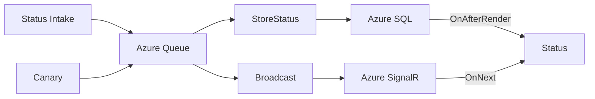

# Dotdev

This is a personal playground and portfolio site for myself. Primarily this is a learning project for Blazor, Azure SignalR and IoT as well as refreshing myself (gradually) on HTML5, CSS and the modern web. 

## Current functionality

1. Index page built with a Honeycomb/Hex style. 

1. Console-style footer for messages

1. Periodic table-style Status page that acts as a display for the back-end of my IoT pipeline.

1. Backing Azure Functions and Azure SQL

## Structure

This webpage is a .NET 6 [Blazor WebAssembly](https://docs.microsoft.com/aspnet/core/blazor/?view=aspnetcore-6.0#blazor-webassembly) client application, two seperate .NET 6 C# [Azure Functions](https://docs.microsoft.com/azure/azure-functions/functions-overview), and a C# class library with shared code.

Index.razor contains two main components: HexPath and ConsoleFooter. There is also a NavBar that's still in progress.

### HexPath

HexPath is a Grid of UI elements, shaped as hexagons that are meant to gradually unlock. These elements, based off the abstract HexItem class, have a locked (aka Ghost) state and an unlocked state that is interactable. The main intro hex is unlocked on load, but the remaining hexes are unlocked with a simple mouseover (but could be instead unlocked either with onclick or from other hexes as a dependency graph.) Hexes can either link to internal (or external) links or can write text to the console Footer.

Each hex is drawn with an SVG with params that are in the HexStyle class. HexStyle controls other css/design elements as well.

The Grid is setup in the Honeycomb class. FOr the current version, hexes are placed statically. 

### ConsoleFooter

ConsoleFooter is a page footer that uses IJSRuntime to run functions in the consoleFeels.js file. This file will print out text one character per Timer tick until all lines in the string array are complete. Once that's complete, it will blink an underscore character for 1000 seconds. The timers are cancelled/reset when the lines to be printed change or when a link hex is clicked.

### Status

The Status page displays the current state of hardware on my personal network. This includes desktops, laptops, network hardware, lights, IoT devices, Hololens and other smart devices. 

### API

The API contains functions to grab element info and device/server state from the Azure SQL database where it's currently cached.

### HubFunctions

This is the back-end of my IoT pipeline. This takes datapoints from local machines on my network (and a Canary Az function) and stores the cache in a SQL database and broadcasts updates to the status page via Azure SignalR.

